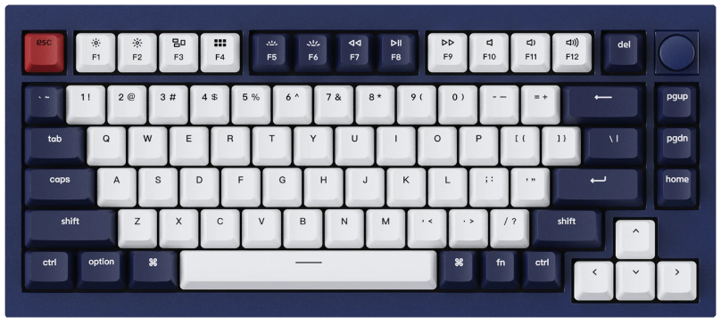

# Keychron Q1 Knob Version *(R2)*

A customizable 75% keyboard.

* Keyboard Maintainer:
  - [Vino Rodrigues](https://github.com/vinorodrigues) *(this build)*
  - [Keychron](https://keychron.com) *(original)*
* Hardware Supported: Keychron Q1 Knob Version
* Hardware Availability: [Keychron Q1](https://www.keychron.com/products/keychron-q1-qmk-custom-mechanical-keyboard-knob-version)

> Please read the [setup instructions / README.md](docs/README.md) on the docs page to enable this build on your installation of QMK.

Make example for this keyboard (after setting up your build environment):

    make custom/keychron_q1_r2:default

Flashing example for this keyboard:

    make custom/keychron_q1_r2:default:flash

See the [build environment setup](https://docs.qmk.fm/#/getting_started_build_tools) and the [make instructions](https://docs.qmk.fm/#/getting_started_make_guide) for more information. Brand new to QMK? Start with our [Complete Newbs Guide](https://docs.qmk.fm/#/newbs).

## Bootloader

Enter the bootloader in 3 ways:

* **Bootmagic reset**: Hold down the key at (0,0) in the matrix (usually the top left key or [Esc] key) and plug in the keyboard
* **Physical reset button**: Briefly press the button under the space bar
* **Keycode in layout**: Press the key mapped to `RESET` if it is available
